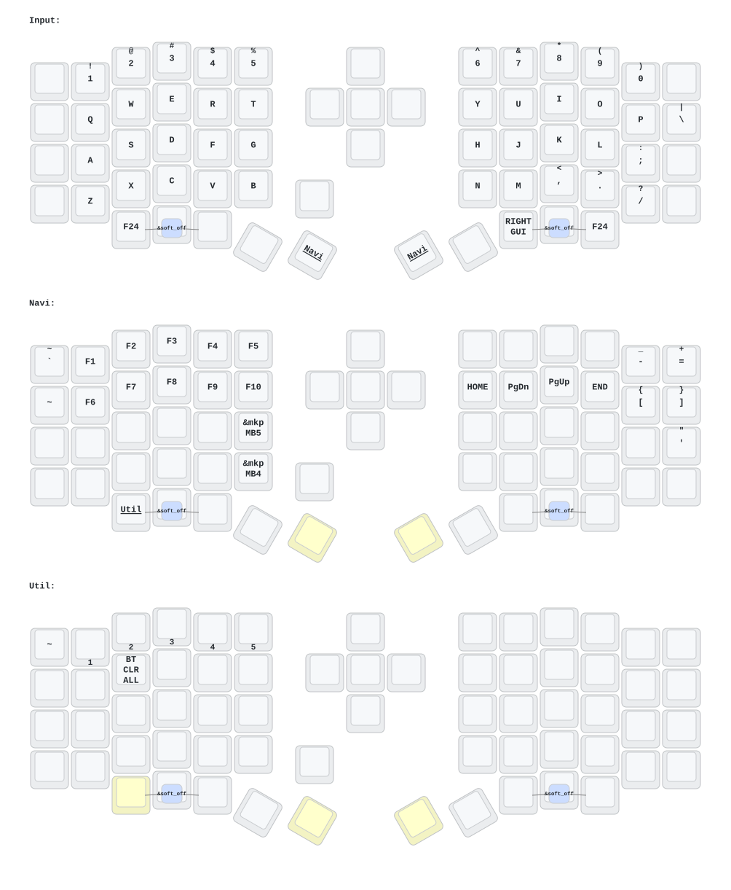

# ZMK Config - Sofle 鍵盤設定檔

> **Fork 專案說明**
> 本專案於 **2026 年 3 月** (請依實際 Fork 時間修改) Fork 自上游原始倉庫，主要用於個人 Sofle 鍵盤的按鍵佈局（Keymap）客製化、功能微調與自動化韌體編譯管理。

本倉庫包含 **Sofle** 無線分離式鍵盤的客製化 ZMK 韌體設定檔。

> Written by Gemini

---

## 按鍵編輯與韌體編譯

### 1. 使用 Keymap Editor（推薦）
建議直接使用網頁版的 [Keymap Editor](https://nickcoutsos.github.io/keymap-editor/) 來修改鍵位：
* **免安裝與視覺化**：直覺的圖形介面，輕鬆調整各層鍵位與巨集。
* **無縫串接 GitHub CI/CD**：授權連結此 GitHub 倉庫後，在網頁上儲存變更就會自動 Commit 並觸發 GitHub Actions 開始編譯韌體，非常方便。

### 2. 手動修改設定檔
* 你也可以直接編輯專案中 `config/` 資料夾下的設定檔（例如 `config/sofle.keymap` 或 `config/sofle.conf`）。
* 修改完成並 Commit / Push 至 `main` 分支後，GitHub Actions 即會自動啟動建置流程。

---

## 取得韌體 (GitHub Actions)

1. 當變更提交至 GitHub 後，切換至本倉庫的 Actions 分頁。
2. 點擊最新的 Workflow 運行紀錄。
3. 在頁面下方的 Artifacts 區塊下載編譯好的 `.uf2` / `.bin` 韌體檔案。

---

## 刷機教學 (Flashing Instructions)

1. 將目標鍵盤半邊（或接收器 Dongle）連點兩下 Reset 按鈕以進入 Bootloader 模式。
2. 使用 USB 線將其連接至電腦，電腦會將其識別為外接磁碟機（例如：`NICENANO`）。
3. 將對應的 `.uf2` 韌體檔案拖放（或複製）至該磁碟機中：
   * `sofle_left.uf2` / `sofle_left_nice_view.uf2` -> 左手邊
   * `sofle_right.uf2` / `sofle_right_nice_view.uf2` -> 右手邊
4. 寫入完成後，磁碟機會自動卸載並重啟，即完成刷機。

> **疑難排解 / 重置（Reset）：**
> 若藍牙配對異常或左右手無法連線，請先將 `settings_reset.uf2` 刷入左右兩邊進行設定重置，再重新刷入主韌體。

---

## 本地端開發 (選用)

如果你習慣在本地使用 `west` 或 Docker/Podman 環境進行編譯：

```bash
# 複製專案
git clone [https://github.com/GrislyMe/zmk-sofle.git](https://github.com/GrislyMe/zmk-sofle.git)
cd zmk-sofle

# 初始化 West 工作區
west init -l config
west update

# 編譯韌體
west build -s zmk/app -b sofle_left -- -DZMK_CONFIG="$PWD/config"
```

